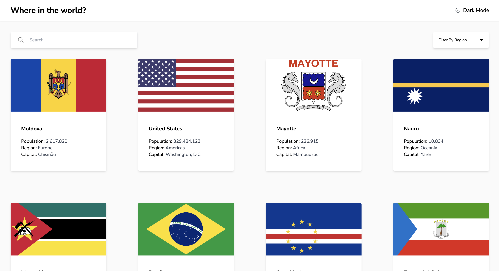

## Frontend Mentor - REST Countries API with color theme switcher solution

This is a solution to the [REST Countries API with color theme switcher challenge on Frontend Mentor](https://www.frontendmentor.io/challenges/rest-countries-api-with-color-theme-switcher-5cacc469fec04111f7b848ca)

## Table of contents

- [Overview](#overview)
  - [The challenge](#the-challenge)
  - [Screenshot](#screenshot)
  - [Links](#links)
- [My process](#my-process)
  - [Built with](#built-with)
  - [What I learned](#what-i-learned)
  - [Continued development](#continued-development)
- [Author](#author)

## Overview

### The challenge

Users should be able to:

- See all countries from the API on the homepage
- Search for a country using an `input` field
- Filter countries by region
- Click on a country to see more detailed information on a separate page
- Click through to the border countries on the detail page
- Toggle the color scheme between light and dark mode _(optional)_

### Screenshot



### Links

- Solution URL: [Github](https://github.com/okori97/countries-app/tree/main)
- Live Site URL: [Vercel](https://countries-app-seven-fawn.vercel.app/)

## My process

### Built with

- Typescript
- Tailwind
- NextJS
- comma-number
- Fontawesome
- country-list
- [React](https://reactjs.org/) - JS library
- [Next.js](https://nextjs.org/) - React framework

### What I learned

Nextjs. Dynamic routing and app router. I mostly use express and node for my server side stuff so this was the first time i used nextjs and app router. I love being able to opt into the client. It was a bit confusing at first but i was able to get it to work.

The t3 scaffolding, whilst a bit excessive for this project, was great for getting started with nextjs.

```<AppContext.Provider
      value={{
        region,
        setRegion,
        countries,
        setCountries,
        search,
        setSearch,
        darkMode,
        setDarkMode,
      }}
    >
      {children}
    </AppContext.Provider>

 Declaring global state context in one file then importing it as and when felt clean, i like this approach.
```

### Continued development

Build more serverside stuff. I think it was wise to pick a simpler project to get started with nextjs and app router, but i know i'd have more fun with a more complex project.

## Author

- Website - [Okori Lewis-McCalla](https://www.okori.com)
- Frontend Mentor - [@okori97](https://www.frontendmentor.io/profile/okori97)
- Twitter - [@onlyokori](https://www.twitter.com/onlyokori)
